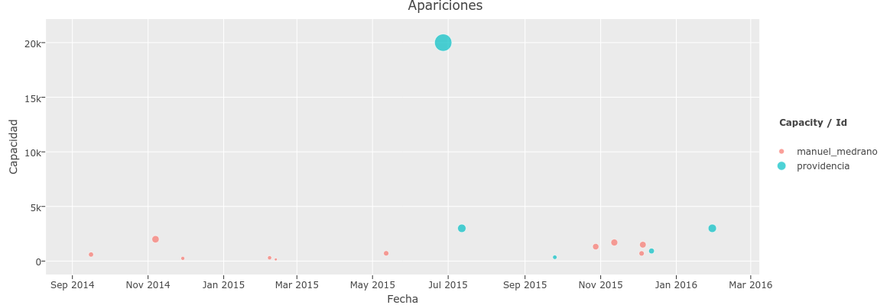
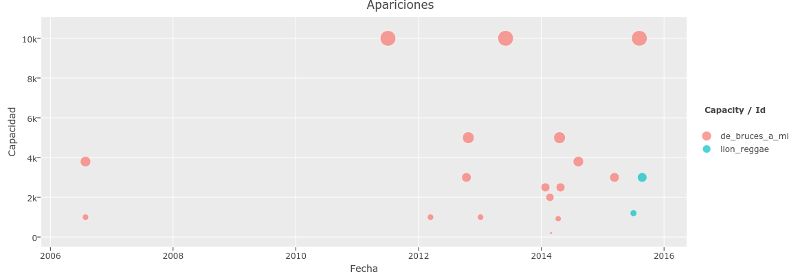
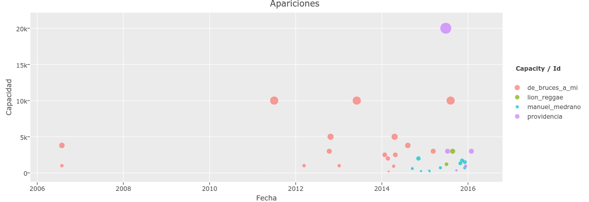

# Popularidad  vs. Apariciones

Las redes sociales traen una transformación en la percepción de la popularidad.

Se observa un fenómeno al comparar la popularidad en redes de Manuel Medrano con 14 millones de views en YouTube contra Providencia con 1 millón, donde pareciera que Medrano es 14 veces más popular que providencia, pero en el territorio los proyectos se comportan bastante parejos.

La gráfica muestra como evoluciona en el tiempo la capacidad de los sitios en donde se presentan.

Segundo caso donde presentamos a Lion Reggae con mas de 9 millones de vistas en youtube, comparado con De Bruces a Mi que tiene una tercera parte, mas de 3 millones de vistas.

Y veamos a los cuatro integrados:

Los proyectos musicales volcados a los ríos virtuales parecieran abandonar el heroísmo de emprender sus propios conciertos contribuyendo a profundizar la ausencia de los conciertos medianos dejando la visibilidad en los dos extremos del espectro, grandes festivales o pequeños bares.
