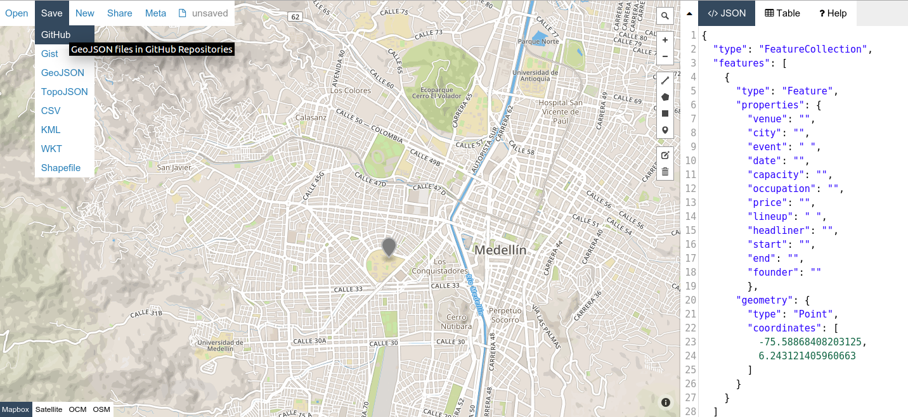
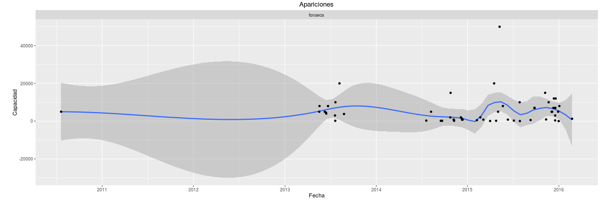

# Datos abiertos para la toma de decisiones en la industria musical local
Por: Federico López//Julián Giraldo//Beatriz Tenorio
## Abstract
El panorama actual de la industria musical se ha desarrollado con base en suposiciones, experiencias individuales, o indicadores poco reales entregados por las analíticas de las redes sociales, urge entonces encontrar mediciones verificables para el estudio de sus fenómenos.
Ante la notable ausencia de estadísticas públicas usables en el sector de la  música en vivo, se pretende integrar y desarrollar herramientas que dispongan datos abiertos con el fin de entender la manera como se relacionan  las apariciones de un proyecto musical  y el territorio. Este sistema permite, entre otras cosas, diseñar estrategias de crecimiento, comparar proyectos musicales entre sí, visualizar su expansión en el espacio y el tiempo y extraer tendencias a partir de la suma de comportamientos particulares; a través de la creación de datos estadísticos que puedan ser consumidos por máquinas para análisis a gran escala.

Sin desconocer las posibilidades de monetizar contenidos en línea y otro tipo de acciones, la música en vivo tiene un potencial de retorno eficiente, replicable y escalable y el mercado musical ha migrado del disco al concierto, por lo que se hace fundamental crear un entorno favorable al desarrollo de herramientas de medición y análisis que permitan la consolidación de la industria musical a partir de la toma de decisiones estratégicas y políticas basadas en cifras y datos reales.

## 1.	De lo estético a lo económico

A principios del siglo XX, se empezó a tener en cuenta la relación, hasta el momento ignorada, entre la economía y la cultural ya que los teóricos alemanes Max Horkheimer y Theodor Adorno[1] reconocieron que el arte, además del simbólico, podría tener un valor económico.

Este reconocimiento despertó las alarmas y permitió que se iniciara un movimiento a nivel global que plantea la posición estratégica de la cultura en el desarrollo de los países y evidencia las relaciones trasversales que puede tener con sectores como el educativo, la seguridad, la convivencia ciudadana y por supuesto el desarrollo económico.

Lo anterior, generó una nueva proyección para la cultura como industria que lentamente ha ido tomando fuerza, la resignificación de conceptos como cadena de valor y modelo de negocios aplicados a los procesos creativos y la apertura a nuevas posibilidades de desarrollo para el sector abrió la puerta a transformaciones importantes y significativas.

Esta nueva forma de ver el arte, no sólo como transformador y comunicador desde lo simbólico y lo cultural, si no, como generador de desarrollo desde lo económico, ha permitido el reconocimiento de una industria y su valoración como generadora de crecimiento y riqueza; lo que hizo que cobrara fuerza como dinamizadora de la economía en los países no sólo en vía de desarrollo, sino también del primer mundo. El Banco Interamericano de Desarrollo –BID- en su libro “La Economía Naranja”[2] plantea que para el año 2011, la economía cultural alcanzó los 4.3 billones de dólares.

Si bien esta tendencia ha beneficiado el desarrollo de la industria en todos los sectores, en especial el musical, ha encontrado en ella una oportunidad para reinventarse y recuperarse luego de más de una década de decrecimiento continuo; según PwC, se espera que el gasto global en música pase de $ 49.9 billones en 2012 a $ 53.8 billones en 2017, con una tasa de crecimiento anual del 2%[3], sin embargo, para lograrlo, ha tenido que enfrentarse a importantes transformaciones.

La oferta digital presente en plataformas como Deezer, Itunes y Spotify entre otras ha permitido mayor acceso de los usuarios a los contenidos, diversificando la oferta, ha generado desarrollos tecnológicos que permiten nuevos modelos de negocio como emisoras on line, canales de reproducción y servicios por suscripción y ha creado nuevos forma de relacionamiento para los artistas, no sólo con su público, si no con sus colegas.

Sin embargo, el mercado ha vuelto la esencia de su modelo de negocios hacia la música en vivo, que ha presentado un importante crecimiento a nivel mundial, lo que ha generado nuevas oportunidades para el desarrollo de los planes estratégicos para los artistas.

Colombia no escapa a esta tendencia, según la Cuenta Satélite de Cultura[4], la venta de servicios de producción y presentación de espectáculos en vivo, presentó un incremento real del 28% entre 2005 y 2010, pasando de $432.000 millones en 2005 a $555.000 millones en 2010, a precios constantes. Lo anterior, demuestra que los emprendedores musicales se ven enfrentados al reto de transformar sus modelos de negocios y centrar el desarrollo de los planes estratégicos y de marketing en el crecimiento de las presentaciones en vivo; aún sobre la grabación de discos.

## 2.	Escasez de datos para la planeación estratégica

Si bien el sector se ve abocado a la creación de planes estratégicos, los managers o consultores, se enfrentan a la inexistencia de datos estadísticos que les permitan hacerlo asertivamente y generalmente deben tomar decisiones con base en supuestos o a partir de los índices de popularidad, en muchos casos, inflados artificialmente, que arrojan las redes sociales; de la misma manera, los gobiernos y organismos privados nacionales e internacionales tampoco cuentan con información confiable que les ayude no sólo a medir el impacto de sus políticas y programas, si no que les permita generar un sistema estadístico y de datos abiertos para una industria en crecimiento.

La Carta Cultural Iberoamericana[5], plantea la importancia de construir y reforzar plataformas diversas para generar acuerdos que busquen el fortalecimiento de las industrias culturales en todos los campos de la producción cultural, creativa y artística. Para lograrlo es necesario disponer de información confiable y de sistemas estadísticos que tengan un marco común.

En el tema de los “Open Data”, el gobierno ha abierto un espacio importante http://datosabiertoscolombia.cloudapp.net/, pero aún son escasos los proyectos que generen Datasets en el área de la industria de la música. Si bien el Ministerio de Cultura ha hecho esfuerzos importantes en la creación de sistemas estadísticos, donde se destaca la Cuenta Satélite de Cultura, en palabras de Ángel Eduardo Moreno, director del grupo de Emprendimiento del Ministerio de Cultura[6] , “…todavía son insuficientes los estudios con los que contamos en el país; en especial, para aproximarnos a las lógicas y dinámicas contemporáneas a las que se enfrenta cada uno de los sectores de la cultura, en el contexto de un mundo que ha cambiado su relación con los modelos de producción, distribución, comercialización y consumo, marcados por las ya no tan nuevas tecnologías de la información y las comunicaciones”.
Si bien las Cuentas Satélite de Cultura son un indicador importante para analizar información macroeconómica, sus datos no permiten llegar al nivel de desglose necesario para que un artista ubique su proyecto en el contexto local y cuente con cifras que arrojen estadísticas fundamentales para la proyección de su carrera.
Uno de los principales obstáculos que presenta la transición hacia un sistema de datos abiertos es que tradicionalmente la industria ha manejado la información con secreto industrial como privilegio para su propio proyecto, lo que ha impedido un entorno de información pública, incluso en entidades del gobierno que están en la obligación de exponer sus datos. Aprender a diferenciar entre información privada, información sensible e información pública podría favorecer la capacidad de exponer los aspectos públicos de los datos que recolectan estos actores culturales en formatos que una maquina pueda leer y escribir.
Dado que el mercado musical ha migrado gran parte de sus modelos de negocio a los conciertos, se propone la construcción de un sistema para el registro de las apariciones en vivo; tomando como referencia indicadores como el tamaño de los lugares donde se presentan, su georeferencia y otros datos asociados, dejando abierta la posibilidad de integrar, para su análisis, factores exógenos como el clima o el contexto social y político del territorio.

## 3.	Sistema de datos abiertos para la toma de decisiones en la industria musical local
La propuesta tiene como objetivo generar un entorno de datos abiertos para la industria musical local  acompañado de estudios de caso reproducibles (reproducible research) de modo que sean útiles para los actores del sector a la hora de realizar análisis, generar debates, tomar decisiones y diseñar planes, proyectos o políticas.

En una primera etapa se expone la importancia de tener un indicador de crecimiento de los proyectos musicales basado en sus apariciones en el territorio, y se crea la estructura para recolectar y exponer este tipo de Datasets; así los datos y las herramientas se van fortaleciendo en la medida que se vayan haciendo análisis específicos y se va enriqueciendo con la capacidad colaborativa de las herramientas seleccionadas.

Por poner un ejemplo de uso, se tomó el caso dos proyectos musicales en el género Reggae, Lion Reggae y Providencia y se analizaron los indicadores de popularidad en redes sociales con el fin de demostrar que dichas analíticas pueden sobredimensionar la realidad.

Lion Reggae cuenta con un número generoso de vistas en su canal de Youtube, 9.002.433 al 15 de enero del 2016, pareciera cinco veces más popular que Providencia quien tiene 1.635.745 vistas a la misma fecha, sin embargo el tamaño de los lugares en los que se presentó el último año[7] no hace eco de esta diferencia teniendo en cuenta la frecuencia de las apariciones y la capacidad de los lugares.

Gráfico 1: Apariciones de Lion Reggae vs. Providencia

Fuente: Construcción propia con base en información de youtube.

## 4.	Descripción de la herramienta
Para el desarrollo de la herramienta se busca apelar a mecanismos de colaboración distribuida en el sector, por eso se utilizaron las siguientes herramientas: geojson.io, GitHub y R para el registro,  almacenamiento, procesamiento y análisis. Geojson.io permite crear mapas y tablas con una interfaz simple. Por cada agrupación se tiene un mapa con marcadores por cada aparición junto a la siguiente información estructurada:

Id – Venue – Event – Date – Capacity – Occupation – Price – Lineup –  Address – Start - End	 – Founder – Headliner – City - X- Y

Gráfico 2: Interfaz de geojson.io

 Fuente: Construcción propia

El mapa es almacenado en la plataforma GitHub que permite llevar un control histórico de versiones y tener aportes de manera distribuida. De esta manera cada colaborador tiene una copia y actualiza el repositorio de apariciones de proyectos musicales que es el que centraliza la información.
Ver: https://github.com/son0p/apariciones_proyectos_musicales

Gráfico 3: Repositorio GitHub

Fuente: Construcción propia
A partir de los datos de ese repositorio se consultan las relaciones entre proyectos musicales de manera automática y escalable usando scripts de R (lenguaje estadístico de código abierto):
https://github.com/son0p/exploracion_datos/blob/master/visualizacion_apariciones.R
Teniendo un  entorno abierto cualquier interesado puede enriquecer o consumir los datos,  emprender la búsqueda de respuestas a preguntas estratégicas, encontrar su posición respecto a un sector, hacer públicos los fenómenos encontrados, lo que facilita y estimula a otros  participantes a exponer los aspectos públicos de los datos que recolectan en el desarrollo de su misión.
## 5. Ejemplos de uso de los datos

### Estudio de caso 1: Comparar un proyecto musical con otros de géneros cercanos y trayectoria parecida
Grupo 1: Laura y la Máquina de Escribir

Laura y la Máquina de Escribir es el proyecto musical de una cantante, compositora, teclista y productora Colombiana de pop alternativo. Sus canciones son la mezcla de sus dos pasiones, la música y la literatura, hechas con un estilo muy imaginativo y cinematográfico. Donde expresa sus emociones más íntimas de manera bella contando historias de amor y desamor. Con su voz femenina y sutil nos hace viajar entre mundos fantásticos y reales con fuerza y contundencia. En 2011, a su regreso de los Ángeles, Laura conformó la banda, en 2013 lanzó “Labertinto” su primer trabajo discográfico. Desde el inicio de la banda hasta enero de 2016, tuvo veinticinco (25) apariciones en vivo en ciudades como Bogotá y Medellín.
Para el caso de estudio se tomó la información de apariciones en vivo del último año -2015- de Laura y cuatro artistas similares en cuanto al género y el desarrollo de sus proyectos : Esteman, Pedrina y Rio, Juan Pablo Vega y Manuel Medrano y se realizó el registro de los siguientes items: fecha y hora, sitio del evento (ubicado en mapa), ocasión, fecha, capacidad del sitio, aforo (en algunos casos que esta información estaba disponible), costo de la entrada, otros grupos que tocaron, link del evento, hora de inicio, hora de finalización.

Gráfico 4: Apariciones Laura y la máquina de escribir – grupos similares

 Fuente: Construcción propia
Lo anterior permite analizar cómo proyectos como Esteman, Juan Pablo Vega y Pedrina y Rio han tenido un crecimiento mucho mayor en frecuencia y tamaño de los lugares, a pesar, incluso de llevar menos tiempo en el mercado. Si revisamos el crecimiento en redes sociales, podemos ver que en facebook, Manuel Medrano cuenta con 118.703 y Esteman con 90.892 versus Pedrina y Rio que tiene 34.741; sin embargo, el crecimiento de esta banda en frecuencia y tamaño de las presentaciones es mucho mayor a todas las demás que participan en la medición.
Laura y la Máquina de Escribir, si bien cuenta con 10.388 seguidores en facebook, la estadística nos muestra que el tamaño de sus presentaciones no supera las cien (100) personas y que aún no cuenta con una frecuencia constante de apariciones.

Este tipo de información, y toda aquella que pueda ser útil a los managers y consultores, hace que el sistema facilite no sólo el registro estadístico, sino que permite el análisis estratégico de los grupos lo que les va a permitir tomar decisiones que realmente potencialicen el desarrollo de sus carreras y optimizar los recursos, generalmente escasos, en tiempo y dinero.

### Estudio de caso 2: Comparar un proyecto musical emergente con un artista masivo
De manera rápida se comparó el desempeño de un artista masivo como Fonseca y un grupo emergente como Laura y la Máquina de escribir, se puede  ver su posición dentro del enjambre y notar sus variaciones.

Gráfico 5: Comparación artistas emergentes con artista masivo

Fuente: Construcción propia
A continuación se muestran las presentaciones de los grupos seleccionados ubicados en el mundo, el radio del círculo da cuenta de la capacidad del lugar y el color de la agrupación (Se incluye Fonseca para comparar con un artista masivo)

Gráfico 6: Ubicación de las presentaciones

Fuente: Construcción propia
### Estudio de caso 3: Construcción de un  Indicador de crecimiento a partir de  apariciones en el territorio
Para este estudio se relacionan los tamaños de los lugares y la frecuencia de las presentaciones en un período determinado para obtener una curva que permite evaluar la manera como se está desarrollando el proyecto en el tiempo. Se ajusta la tensión para lograr  una curva más suave que nos muestre mejor una tendencia.

Gráfico 7: Tendencia extraída de las apariciones de Fonseca - Generada con datos desde el repositorio de Github

Fuente: Construcción propia

Gráfico 9: Tendencias de proyectos seleccionados

Fuente: Construcción propia

## 6.	Conclusiones

·         Analizar las apariciones de los grupos en el territorio es una alternativa con información más verificable que las estadísticas de redes sociales.

·         Tener este tipo de datos abiertos invita a múltiples agentes a emprender nuevas formas de entender las dinámicas de la industria musical local.
·
El proyecto musical que pretende tener una buena porción de sus ingresos producto de presentaciones en vivo podría encontrar de mucha utilidad estos repositorios de datos abiertos, sirviéndole para múltiples fines, entre otros, medir su rendimiento en un período de tiempo, compararse con otros proyectos musicales, evaluar la penetración en un territorio o mercado, identificar tendencias generales, etc.

## 7. Retos
El principal reto al que se enfrenta la construcción de un sistema de datos abiertos está en la fidelidad, a medida que crezcan los datos y sean usados por más participantes se creería que la comunidad misma se encargará de corregir errores en los ingresos, sin embargo, sistemas como Wikipedia[8] ha demostrado que datos erróneos pueden permanecer mucho tiempo; por lo anterior, se hace fundamental la sistematización de la herramienta y la construcción de un protocolo para la recolección e ingreso de los datos.

En un gobierno estructurado en sistemas de software privativo se hace difícil definir unas especificaciones estándar que recauden efectivamente los aspectos de interés del sector de manera que pueda ser usado por múltiples  entidades.

En el caso del indicador de una tendencia, pueden existir casos que “contaminen” o hagan variaciones “anti-naturales” a la curva en un género. Por ejemplo un grupo que se resiste a ser masivo e intencionalmente se presenta en sitios pequeños, o con diferentes nombres para confundir su audiencia[9].

Una tendencia puede verse afectada por agentes externos que detienen el crecimiento “normal” de un grupo: embarazo de algún integrante, apariciones no orgánicas generadas por amistad con entidades públicas que gestionan eventos, participación en algún grupo político que se encuentre en el poder, etc.

## 8.	El futuro
En el aspecto conceptual, quedan las herramientas dispuestas para nuevos análisis, visualizaciones, investigaciones e interpretaciones artísticas, por lo que es fundamental afinar el sistema en el protocolo de recolección de los datos y diseñar uno o varios front que faciliten el proceso de consulta y retroalimentación.
En el corto plazo, se podrá medir, por ejemplo, el proceso de internacionalización de un género, el impacto de premios como los Grammy Latinos, Shock, etc, el reflejo de la popularidad inflada artificialmente en las apariciones en el territorio, responder preguntas como: ¿un ganador del Factor X puede sostener una tendencia creciente? ¿Durante cuánto tiempo? ¿Son las becas y estímulos gubernamentales verdaderas ayudas a largo plazo?, entre otras.
En los aspectos técnicos es posible implementar nuevos algoritmos para el procesamiento, entendimiento,  y visualización de los datos, algunos notables como Holt-Winters[10] lo que permitirá hacer intentos por predecir una temporada con base en el  historial de apariciones del proyecto musical.
Finalmente son favorables las condiciones que definan las especificaciones para  un formato estándar[11] de datos abiertos, adecuado para registrar las apariciones de un proyecto musical, que facilite la integración y traducción a otros esquemas de datos abiertos y enriquecer sus relaciones con otros eventos.

[1] HORKHEIMER, Max y ADORNO, Theodor, Dialéctica del iluminismo, Sudamericana, Buenos Aires, 1988.
[2] BUITRAGO, Felipe y DUQUE, Iván, La Economía Naranja, una Oportunidad Infinita. BID. 2013
[3] BARRERO, Juliana. MACHICADO, Javier.  Tendencias de la industria musical en Colombia. Alcaldía Mayor de Bogotá DC, Invest in Bogota, Varios. Serie Música # 1. 2015.
[4] MINISTERIO DE CULTURA DE COLOMBIA. Cultura a la medida. Análisis de la Cuenta Satélite de Cultura en Colombia. 2015
[5] Organización de Estados Iberoamericanos -OEI- XVI Cumbre Iberoamericana de Jefes de Estado y de Gobierno Montevideo, Uruguay 4 y 5 de noviembre de 2006. Carta Cultural Iberoamericana.
[6] MINISTERIO DE CULTURA DE COLOMBIA. Cultura a la medida. Análisis de la Cuenta Satélite de Cultura en Colombia. 2015
[7] Datos:
https://github.com/son0p/apariciones_proyectos_musicales/blob/master/providencia.geojson
https://github.com/son0p/apariciones_proyectos_musicales/blob/master/lion_reggae.geojson
[8] http://www.buzzfeed.com/fjelstud/the-100-longest-entries-on-wikipedia
[9] http://www.musictimes.com/articles/24870/20150116/7-solo-artists-performed-under-multiple-names-puff-daddy-john-mellencamp.htm
[10] http://labs.omniti.com/people/jesus/papers/holtwinters.pdf
[11] http://www.codeforamerica.org/our-work/data-formats/
